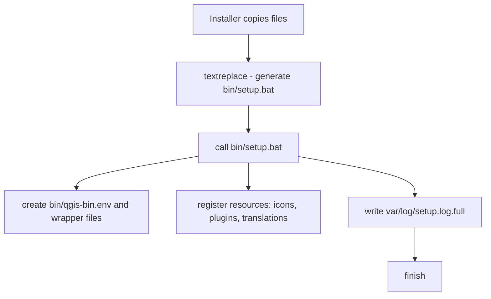
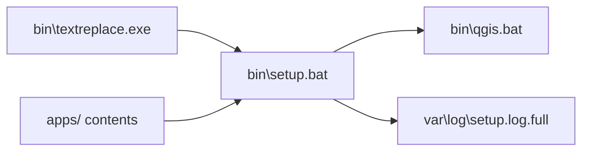
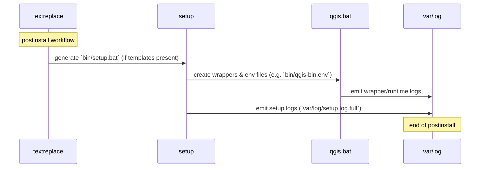

POSTINSTALL — what runs after installation (detailed)
===============================================

This document explains the postinstall/template-patching workflow used by the
OSGeo4W-style portable QGIS tree in this repository. It is intended for
maintainers, packagers, and developers who need to understand what files
are created/modified at postinstall time, what inputs each step needs, and
what outputs to expect.

High level overview
-------------------

The postinstall flow does three main things:

- Patch distribution templates into generated wrapper scripts (so they contain
  absolute paths for the current installation location).
- Run per-install setup scripts to write environment files and register
  resources (icons, plugins paths, translation files).
- Optionally run wrapper postinstall steps that finalize runtime state.

Mermaid flow (high-level):



Detailed sequence (files and actions)
-------------------------------------

1. bin\textreplace.exe (optional)

- Purpose: rewrite template files into generated scripts that embed the
  installation path. Historically used to convert `.tpl` files into actual
  `.bat` wrapper scripts that contain absolute paths.
- Typical invocation:

  ```bat
  bin\textreplace.exe -std -t bin\setup.bat
  ```

- Inputs:
  - template files under `setup/` or `templates/` (packaged with the tree)
  - the current working directory / script location (to compute install root)
- Outputs:
  - `bin\setup.bat` (generated). This script contains install-specific
    commands and references to absolute paths such as `%OSGEO4W_ROOT%`.
- Notes:
  - Not every distribution includes `bin\textreplace.exe`. When absent,
    postinstall may rely directly on `etc\postinstall\setup.bat`.

2. bin\setup.bat (generated) or etc\postinstall\setup.bat (packaged)

- Purpose: perform per-install setup actions. This is the main postinstall
  entrypoint and will run configuration steps needed to make the portable tree
  functional in its install path.

- Typical actions performed by the generated `bin\setup.bat`:
  - Recreate `bin\qgis-bin.env` or other `.env` files used by the wrappers.
  - Create per-install wrapper scripts (for example `qgis.bat`) if not present.
  - Register file-type associations (if the packaging step supports it).
  - Copy or link resource files into the expected places.
  - Write `var/log/setup.log.full` with the full postinstall console output.

- Inputs:
  - The installation root (script location) and the content shipped in the
    tree (apps/, bin/, etc/).
  - Optionally, values injected by the installer (registry, env vars).

- Outputs:
  - Generated environment files, updated wrapper scripts, `var/log` logs.
  - Exit code indicates success (0) or failure (non-zero).

3. bin\qgis.bat --postinstall (optional wrapper finalization)

- Purpose: some wrappers provide an extra `--postinstall` mode that will
  perform additional finalization (for example: copying plugin metadata,
  confirming Qt plugin paths, or writing small caches).
- Inputs: existing wrapper and installed resources.
- Outputs: final wrapper state; log messages in `var/log`.

Files created/modified by postinstall (common list)
--------------------------------------------------

| File/Path | Purpose | Notes |
|---|---:|---|
| `bin\setup.bat` | Generated install-specific setup script | Created by `textreplace` or provided by installer |
| `bin\qgis-bin.env` | Environment file consumed by `qgis` wrapper | Contains PATH/QT_PLUGIN_PATH overrides |
| `bin\qgis.bat` | Runtime wrapper for starting QGIS | Sets QGIS_PREFIX_PATH, QT_PLUGIN_PATH, VSI_CACHE, then starts `qgis-bin.exe` |
| `var\log\setup.log.full` | Full postinstall console output | Useful for diagnosing installation issues |
| `apps\qgis\python\...` | Python packages and plugins | Postinstall may write or validate these |

Dependencies and information required at postinstall
---------------------------------------------------

- The postinstall step needs to know the install root. This can be computed
  from the script location (`%~dp0`) or provided by the wrapper that invoked
  it.
- The postinstall needs access to all shipped content (apps/, bin/, etc/).
- Tools that may be required at postinstall time:
  - `bin\textreplace.exe` (template patching)
  - `bin\python.exe` (if postinstall runs Python helpers)
  - `7z.exe` or other archive tools (rare, for unpacking resources)

Example diagram showing dependencies



Sequence diagram (postinstall subgraph)



Common failure modes and diagnostics
-----------------------------------

- Missing generated files after copying a tree
  - Symptom: launching `qgis-bin.exe` directly fails with DLL loader errors
    (e.g. "qgis_app.dll not found").
  - Cause: generated wrapper/env files still reference the original install
    path.
  - Fix: run `bin\textreplace.exe -std -t bin\setup.bat` (if present) and
    then `call bin\setup.bat`, or run packaged `etc\postinstall\setup.bat`.

- Postinstall exit with non-zero code
  - Check `var\log\setup.log.full` for the exact failing command and
    stack/echoed output.

- Wrapper still fails after postinstall
  - Run `bin\qgis.bat --postinstall` (if available) to run wrapper finalizers.
  - Compare `var\log\setup.log.full` and `var\log\reinit-latest.log` (if
    reinit helper was used).

Operational notes for maintainers
--------------------------------

- When making packaging changes that affect runtime paths, ensure the
  `textreplace` templates and the `etc\postinstall` scripts are updated in
  tandem.
- Prefer writing robust `bin\setup.bat` scripts that check for existing
  generated files and only overwrite when necessary. This reduces risk when
  automating tree copies.

Examples: `etc\postinstall\*.bat` (actual files in this tree)
------------------------------------------------------------

Below are representative excerpts from the `etc\postinstall` scripts present
in this tree and the typical environment variables they reference or set.
These examples come from the packaged `.bat.done` copies (the postinstall
commands that were executed during the original packaging).

1. `etc\postinstall\setup.bat.done` (excerpt)

```text
for /F "tokens=* USEBACKQ" %%F IN (`getspecialfolder Documents`) do set DOCUMENTS=%%F

if not %OSGEO4W_MENU_LINKS%==0 if not exist "%OSGEO4W_STARTMENU%" mkdir "%OSGEO4W_STARTMENU%"
textreplace -std -t bin\setup.bat
arpregistration
```

Typical env vars referenced/used:

- `OSGEO4W_ROOT` — installation root (computed elsewhere, frequently by `o4w_env.bat`).
- `OSGEO4W_MENU_LINKS`, `OSGEO4W_STARTMENU` — control creation of Start Menu shortcuts.
- `DOCUMENTS` — target directory for user-visible shortcuts (discovered via `getspecialfolder`).

1. `etc\postinstall\qgis.bat.done` (excerpt)

```text
call "%OSGEO4W_ROOT%\bin\o4w_env.bat"
for /F "tokens=* USEBACKQ" %%F IN (`getspecialfolder Documents`) do set DOCUMENTS=%%F

set APPNAME=QGIS Desktop 3.44.3
call "%OSGEO4W_ROOT%\bin\qgis.bat" --postinstall

textreplace -std -t "%O4W_ROOT%\apps\qgis\bin\qgis.reg"
del /s /q "%OSGEO4W_ROOT%\apps\qgis\python\*.pyc"
```

Typical env vars referenced/used:

- `OSGEO4W_ROOT` — used to locate `bin\o4w_env.bat`, wrappers and apps.
- `O4W_ROOT` — short alias used in the script for path manipulation.
- `APPNAME`, `QGIS_WIN_APP_NAME` — used when creating shortcuts and Start Menu entries.
- `DOCUMENTS` — documents folder used for some link targets.

1. `etc\postinstall\qgis-common.bat.done` (excerpt)

```text
call "%OSGEO4W_ROOT%\bin\o4w_env.bat"

path %PATH%;%OSGEO4W_ROOT%\apps\qgis\bin
set QGIS_PREFIX_PATH=%OSGEO4W_ROOT:\=/%/apps/qgis
"%OSGEO4W_ROOT%\apps\qgis\crssync"
```

Typical env vars referenced/used:

- `PATH` — modified to include `%OSGEO4W_ROOT%\apps\qgis\bin` so runtime DLLs are discoverable.
- `QGIS_PREFIX_PATH` — set to a POSIX-like path used by QGIS internals to locate plugins and resources.

1. `etc\postinstall\python3-gdal.bat.done` (excerpt)

```text
textreplace -std -t apps\Python312\Scripts\gdal_calc.py
textreplace -std -t apps\Python312\Scripts\gdal_calc-script.py
... (many textreplace invocations for Python scripts)
```

Typical env vars referenced/used:

- None explicitly set in this snippet, but these commands rely on:
  - `bin\textreplace.exe` being present.
  - the install root to compute target paths under `apps\Python312`.

Other postinstall scripts in this tree
-------------------------------------

The directory contains multiple `python3-*.bat.done` entries used to generate
Python script/tool wrappers and small package-specific setup steps. They
generally run `textreplace -std -t <target>` to create platform-specific
wrappers under `apps\Python312\Scripts` (or occasionally perform tidyups).
They rarely set persistent system-wide environment variables. Below are the
actual `python3-*.bat.done` files in this tree with a one-line summary for
each and a representative excerpt.

- `python3-charset-normalizer.bat.done`

  - Purpose: generate the `normalizer` CLI wrapper under `apps/Python312/Scripts`.

  ```text
  textreplace -std -t apps/Python312/Scripts/normalizer.exe
  ```

- `python3-future.bat.done`

  - Purpose: generate the `futurize` and `pasteurize` CLI wrappers provided by the
    `future` package (compatibility helpers).

  ```text
  textreplace -std -t apps/Python312/Scripts/futurize.exe
  textreplace -std -t apps/Python312/Scripts/pasteurize.exe
  ```

- `python3-gdal.bat.done`

  - Purpose: generate the large set of GDAL/OGR Python CLI scripts (gdal_calc,
    gdal_merge, ogrmerge, gdal2tiles, etc.) under `apps\Python312\Scripts`.

  ```text
  textreplace -std -t apps\Python312\Scripts\gdal_calc.py
  textreplace -std -t apps\Python312\Scripts\gdal_merge.py
  textreplace -std -t apps\Python312\Scripts\ogrmerge.py
  textreplace -std -t apps\Python312\Scripts\gdal2tiles.py
  ... (many more textreplace invocations)
  ```

- `python3-nose2.bat.done`

  - Purpose: generate the `nose2` test-runner wrapper.

  ```text
  textreplace -std -t apps/Python312/Scripts/nose2.exe
  ```

- `python3-numpy.bat.done`

  - Purpose: generate `f2py` (NumPy's Fortran to Python wrapper builder) under
    `apps/Python312/Scripts`.

  ```text
  textreplace -std -t apps/Python312/Scripts/f2py.exe
  ```

- `python3-pygments.bat.done`

  - Purpose: generate `pygmentize` (Pygments CLI) wrapper.

  ```text
  textreplace -std -t apps/Python312/Scripts/pygmentize.exe
  ```

- `python3-pyproj.bat.done`

  - Purpose: generate the `pyproj` CLI wrapper (proj-related helpers).

  ```text
  textreplace -std -t apps/Python312/Scripts/pyproj.exe
  ```

- `python3-pyqt5.bat.done`

  - Purpose: generate Qt tooling wrappers used by PyQt5 (pylupdate5, pyrcc5,
    pyuic5) which are useful when building/translating Qt resources in plugins.

  ```text
  textreplace -std -t apps/Python312/Scripts/pylupdate5.exe
  textreplace -std -t apps/Python312/Scripts/pyrcc5.exe
  textreplace -std -t apps/Python312/Scripts/pyuic5.exe
  ```

- `python3-sip.bat.done`

  - Purpose: generate the `sip` toolchain wrappers (sip-build, sip-install,
    sip-wheel, etc.) used when building SIP-based Python extensions.

  ```text
  textreplace -std -t apps/Python312/Scripts/sip-build.exe
  textreplace -std -t apps/Python312/Scripts/sip-install.exe
  textreplace -std -t apps/Python312/Scripts/sip-wheel.exe
  ```

Summary
-------

Most `python3-*.bat.done` entries are simple wrapper-generators. When moving or
copying the tree to a new location you should re-run the `textreplace` step or
call `bin\setup.bat` so these wrapper scripts are regenerated for the new
install root. Failing to do so will leave script shims and wrappers pointing to
the original packaged paths which can cause runtime failures when invoking
Python tools from `apps\Python312\Scripts`.

General note on `o4w_env.bat` and `etc\ini` files
-------------------------------------------------

Many of the postinstall steps begin with `call "%OSGEO4W_ROOT%\bin\o4w_env.bat"`.
That script (in this tree `bin\o4w_env.bat`) sources the `etc\ini\*.bat`
files which set the low-level runtime environment variables used by wrappers,
for example:

- `GDAL_DATA` — path to GDAL data files
- `PYTHONHOME` / `PYTHONPATH` — Python runtime roots
- `QT_PLUGIN_PATH` — Qt plugin search paths
- `PATH` — extended to include `apps\qgis\bin` and other runtime bins

These `etc\ini` variables are critical: if they are not generated or are
incorrect the runtime will fail to locate DLLs, Python modules, or Qt
plugins.

Environment variables set by `etc\ini/*.bat`
--------------------------------------------

The table below lists the environment variables that the packaged `etc\ini` files set, a representative example value or pattern (using the `%OSGEO4W_ROOT%` placeholder), and the source `ini` file where the assignment appears.

| Variable | Example value / pattern | Source file | Required |
|---|---|---:|---|
| GDAL_DATA | %OSGEO4W_ROOT%\apps\gdal\share\gdal | `etc\ini\gdal.bat` | critical (needed to find GDAL data files) |
| GDAL_DRIVER_PATH | %OSGEO4W_ROOT%\apps\gdal\lib\gdalplugins | `etc\ini\gdal.bat` | critical (required to load GDAL drivers/plugins) |
| OPENSSL_ENGINES | %OSGEO4W_ROOT%\lib\engines-3 | `etc\ini\openssl.bat` | optional (used only if OpenSSL engine loading is required) |
| SSL_CERT_FILE | %OSGEO4W_ROOT%\bin\curl-ca-bundle.crt | `etc\ini\openssl.bat` | optional (recommended for HTTPS; falls back to system certs) |
| SSL_CERT_DIR | %OSGEO4W_ROOT%\apps\openssl\certs | `etc\ini\openssl.bat` | optional (directory form of cert store) |
| PDAL_DRIVER_PATH | %OSGEO4W_ROOT%\apps\pdal\plugins | `etc\ini\pdal-libs.bat` | optional (required for PDAL features only) |
| PROJ_DATA | %OSGEO4W_ROOT%\share\proj | `etc\ini\proj-runtime-data.bat` | critical (PROJ needs datum/epsg grids for coordinate transforms) |
| PYTHONHOME | %OSGEO4W_ROOT%\apps\Python312 | `etc\ini\python3.bat` | critical (points to the bundled Python runtime) |
| PYTHONPATH | (empty) | `etc\ini\python3.bat` | optional (package-specific additions; empty is acceptable) |
| PYTHONUTF8 | 1 | `etc\ini\python3.bat` | optional (recommended for consistent Unicode handling) |
| PATH (prepend) | %OSGEO4W_ROOT%\apps\Python312\Scripts;... | `etc\ini\python3.bat` | critical (ensures bundled Python scripts and tools are found) |
| QT_PLUGIN_PATH | %OSGEO4W_ROOT%\apps\Qt5\plugins | `etc\ini\qt5.bat` | critical (Qt must find its platform and image plugins) |
| O4W_QT_PREFIX | %OSGEO4W_ROOT:\=/%/apps/Qt5 | `etc\ini\qt5.bat` | optional (helper used by packaging and scripts) |
| O4W_QT_BINARIES | %OSGEO4W_ROOT:\=/%/apps/Qt5/bin | `etc\ini\qt5.bat` | optional (POSIX-like path used by some helper scripts) |
| O4W_QT_PLUGINS | %OSGEO4W_ROOT:\=/%/apps/Qt5/plugins | `etc\ini\qt5.bat` | optional |
| O4W_QT_LIBRARIES | %OSGEO4W_ROOT:\=/%/apps/Qt5/lib | `etc\ini\qt5.bat` | optional |
| O4W_QT_TRANSLATIONS | %OSGEO4W_ROOT:\=/%/apps/Qt5/translations | `etc\ini\qt5.bat` | optional (used to locate Qt translations) |
| O4W_QT_HEADERS | %OSGEO4W_ROOT:\=/%/apps/Qt5/include | `etc\ini\qt5.bat` | optional (developer/packaging use) |
| O4W_QT_DOC | %OSGEO4W_ROOT:\=/%/apps/Qt5/doc | `etc\ini\qt5.bat` | optional (documentation path) |

Note: the examples use the `%OSGEO4W_ROOT%` placeholder; the actual absolute
paths are computed at runtime by the bootstrap (`o4w_env.bat`) and by the
generated `bin\setup.bat`/`textreplace` actions. If you copy the tree to a
new location, re-run the reinit/postinstall flow to ensure these values reflect
the new install root.

Where to look for more detail
----------------------------

- `var\log\setup.log.full` — full postinstall output created by `bin\setup.bat`.
- `etc\postinstall\*.bat.done` — packaged record of commands that were run by postinstall; read these for exact command sequences used when the tree was packaged.

*** End of POSTINSTALL.md
