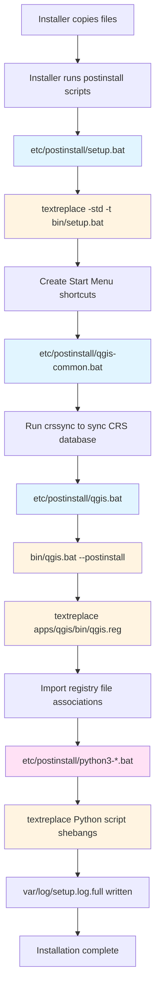
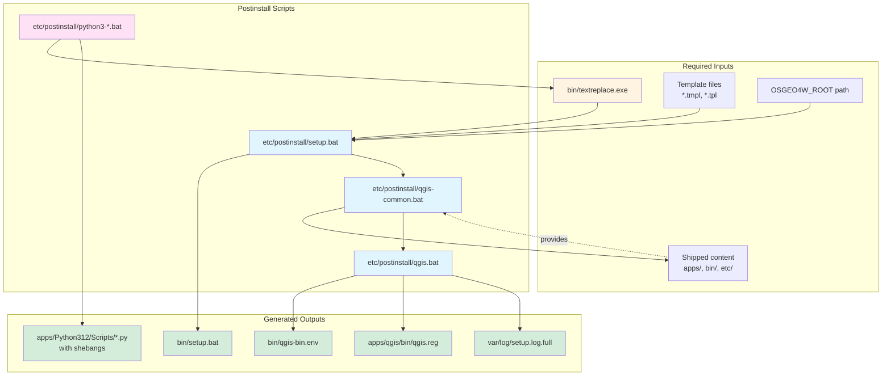
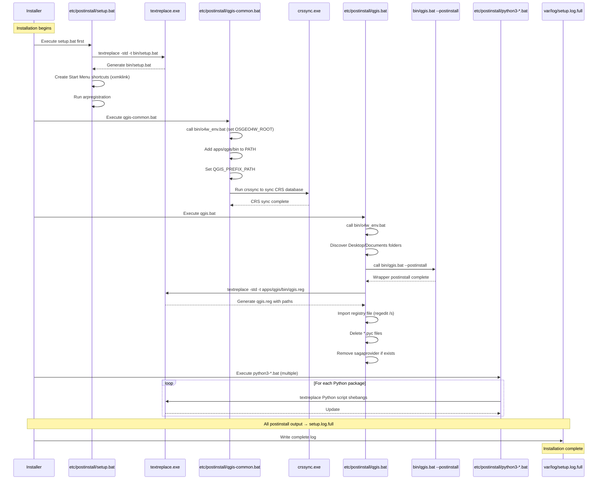
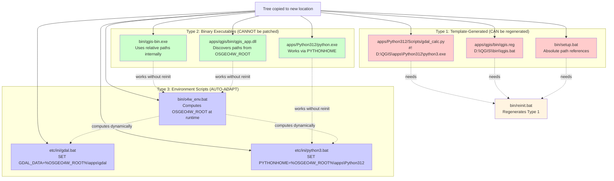
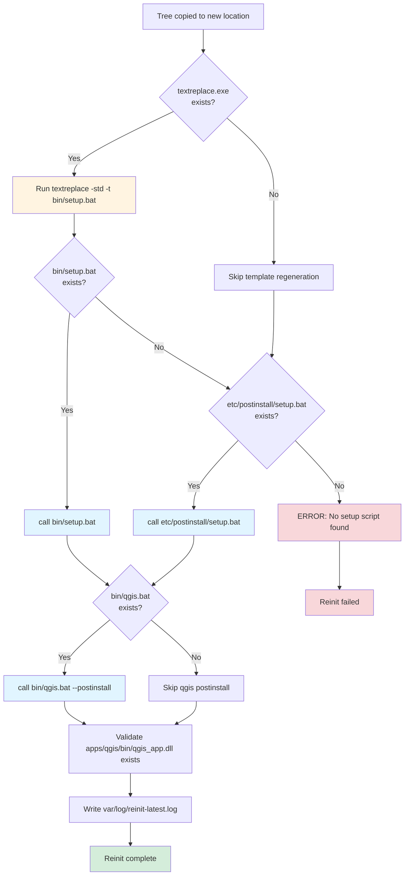
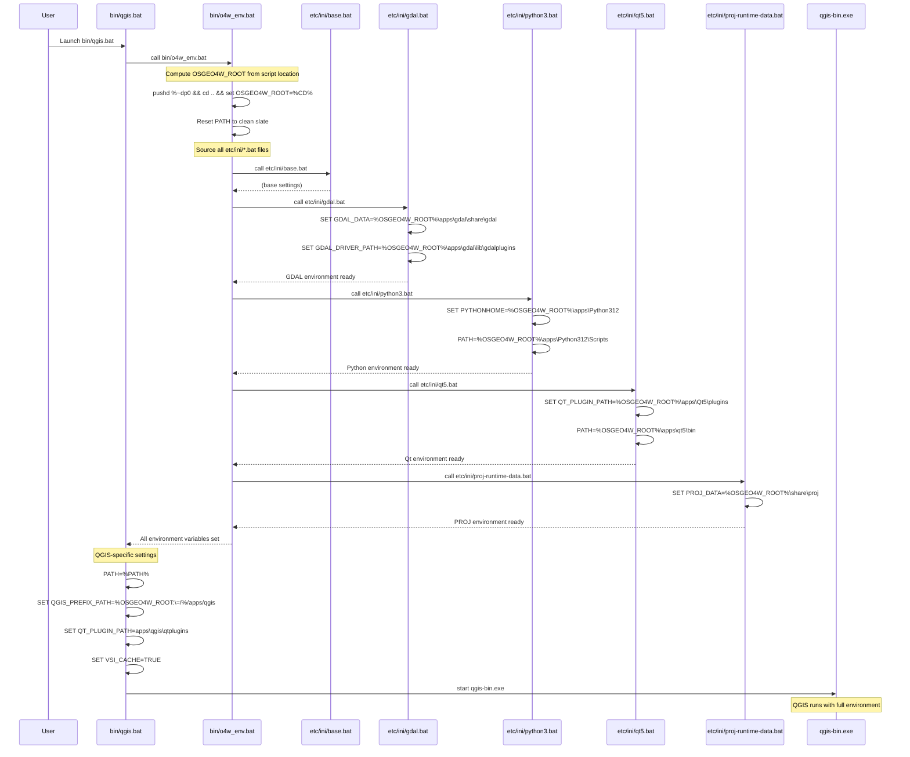

POSTINSTALL — what runs after installation (detailed)
===============================================

This document explains the postinstall/template-patching workflow used by the
OSGeo4W-style portable QGIS tree in this repository. It is intended for
maintainers, packagers, and developers who need to understand what files
are created/modified at postinstall time, what inputs each step needs, and
what outputs to expect.

**Quick Start for Portable Users**: If you just copied this QGIS tree to a new
location and want to make it work, skip to the section ["Making QGIS Portable:
Moving the Tree to a New Location"](#making-qgis-portable-moving-the-tree-to-a-new-location)
or run these commands:

```bat
cd /d <NEW_LOCATION>
bin\reinit.bat
REM -- OR use the automated launcher --
RunQGIS.bat --yes
```

High level overview
-------------------

The postinstall flow does three main things:

- Patch distribution templates into generated wrapper scripts (so they contain
  absolute paths for the current installation location).
- Run per-install setup scripts to write environment files and register
  resources (icons, plugins paths, translation files).
- Optionally run wrapper postinstall steps that finalize runtime state.

Mermaid flow (high-level):



Detailed sequence (files and actions)
-------------------------------------

1. bin\textreplace.exe (optional)

- Purpose: rewrite template files into generated scripts that embed the
  installation path. Historically used to convert `.tpl` files into actual
  `.bat` wrapper scripts that contain absolute paths.
- Typical invocation:

  ```bat
  bin\textreplace.exe -std -t bin\setup.bat
  ```

- Inputs:
  - template files under `setup/` or `templates/` (packaged with the tree)
  - the current working directory / script location (to compute install root)
- Outputs:
  - `bin\setup.bat` (generated). This script contains install-specific
    commands and references to absolute paths such as `%OSGEO4W_ROOT%`.
- Notes:
  - Not every distribution includes `bin\textreplace.exe`. When absent,
    postinstall may rely directly on `etc\postinstall\setup.bat`.

2. bin\setup.bat (generated) or etc\postinstall\setup.bat (packaged)

- Purpose: perform per-install setup actions. This is the main postinstall
  entrypoint and will run configuration steps needed to make the portable tree
  functional in its install path.

- Typical actions performed by the generated `bin\setup.bat`:
  - Recreate `bin\qgis-bin.env` or other `.env` files used by the wrappers.
  - Create per-install wrapper scripts (for example `qgis.bat`) if not present.
  - Register file-type associations (if the packaging step supports it).
  - Copy or link resource files into the expected places.
  - Write `var/log/setup.log.full` with the full postinstall console output.

- Inputs:
  - The installation root (script location) and the content shipped in the
    tree (apps/, bin/, etc/).
  - Optionally, values injected by the installer (registry, env vars).

- Outputs:
  - Generated environment files, updated wrapper scripts, `var/log` logs.
  - Exit code indicates success (0) or failure (non-zero).

3. bin\qgis.bat --postinstall (optional wrapper finalization)

- Purpose: some wrappers provide an extra `--postinstall` mode that will
  perform additional finalization (for example: copying plugin metadata,
  confirming Qt plugin paths, or writing small caches).
- Inputs: existing wrapper and installed resources.
- Outputs: final wrapper state; log messages in `var/log`.

Files created/modified by postinstall (common list)
--------------------------------------------------

| File/Path | Purpose | Notes |
|---|---:|---|
| `bin\setup.bat` | Generated install-specific setup script | Created by `textreplace` or provided by installer. **May be missing if tree was copied without reinit.** |
| `bin\qgis-bin.env` | Environment file consumed by `qgis` wrapper | Contains PATH/QT_PLUGIN_PATH overrides. **May be missing if tree was copied without reinit.** |
| `bin\qgis.bat` | Runtime wrapper for starting QGIS | Sets QGIS_PREFIX_PATH, QT_PLUGIN_PATH, VSI_CACHE, then starts `qgis-bin.exe`. **Usually present** (shipped with installer) |
| `var\log\setup.log.full` | Full postinstall console output | Useful for diagnosing installation issues. Contains absolute paths from original install location |
| `apps\qgis\python\...` | Python packages and plugins | Postinstall may write or validate these |
| `apps\Python312\Scripts\*.py` | Python script wrappers with shebangs | Generated by `textreplace` from `.tmpl` files. **Contain hardcoded paths** to original install location |

Dependencies and information required at postinstall
---------------------------------------------------

- The postinstall step needs to know the install root. This can be computed
  from the script location (`%~dp0`) or provided by the wrapper that invoked
  it.
- The postinstall needs access to all shipped content (apps/, bin/, etc/).
- Tools that may be required at postinstall time:
  - `bin\textreplace.exe` (template patching)
  - `bin\python.exe` (if postinstall runs Python helpers)
  - `7z.exe` or other archive tools (rare, for unpacking resources)

Example diagram showing dependencies and data flow



Sequence diagram (actual postinstall execution flow)



Common failure modes and diagnostics
-----------------------------------

- Missing generated files after copying a tree
  - Symptom: launching `qgis-bin.exe` directly fails with DLL loader errors
    (e.g. "qgis_app.dll not found").
  - Cause: generated wrapper/env files still reference the original install
    path.
  - Fix: run `bin\textreplace.exe -std -t bin\setup.bat` (if present) and
    then `call bin\setup.bat`, or run packaged `etc\postinstall\setup.bat`.

- Postinstall exit with non-zero code
  - Check `var\log\setup.log.full` for the exact failing command and
    stack/echoed output.

- Wrapper still fails after postinstall
  - Run `bin\qgis.bat --postinstall` (if available) to run wrapper finalizers.
  - Compare `var\log\setup.log.full` and `var\log\reinit-latest.log` (if
    reinit helper was used).

Making QGIS Portable: Moving the Tree to a New Location
--------------------------------------------------------

This section provides a detailed guide for users who want to copy this QGIS
installation to a new directory, computer, or external drive. Understanding
what needs to be reinitialized and why is critical for a successful portable
deployment.

### Why Reinitialization is Required

The QGIS tree contains **three types** of files with embedded paths:

1. **Template-generated scripts** (`.bat`, `.py` shebangs)
   - Generated by `textreplace.exe` from `.tmpl` files
   - Contain hardcoded absolute paths (e.g., `D:\QGIS\apps\Python312\python3.exe`)
   - **Can be regenerated** by re-running the postinstall workflow

2. **Binary executables and DLLs**
   - Compiled C++ code that may contain embedded paths or relative path logic
   - **Cannot be patched** - they work via relative paths from `OSGEO4W_ROOT`
   - Will function correctly as long as directory structure is preserved

3. **Environment initialization scripts** (`etc\ini\*.bat`)
   - Use `%OSGEO4W_ROOT%` variable (dynamically computed at runtime)
   - **Do not need regeneration** - they adapt automatically to new location

**Visual breakdown of path handling**:



### Step-by-Step: Making the Tree Portable

**Before copying** (optional but recommended):
```bat
REM From original location, verify the tree is functional
call bin\qgis.bat --help
```

**Copy the entire tree** to the new location:
```bat
REM Example: copy from D:\QGIS to E:\PortableQGIS
xcopy /E /I /H /K D:\QGIS E:\PortableQGIS
```

**After copying** to new location, you have **two options**:

#### Option 1: Automated Reinit (Recommended)

Use the provided `bin\reinit.bat` helper:

```bat
REM Navigate to new location
cd /d E:\PortableQGIS

REM Run the reinitializer (creates log in var\log\reinit-latest.log)
bin\reinit.bat

REM Verify success
type var\log\reinit-latest.log
```

What `reinit.bat` does:
- Runs `textreplace.exe -std -t bin\setup.bat` to regenerate setup script
- Calls `bin\setup.bat` to recreate environment files
- Runs `bin\qgis.bat --postinstall` to finalize wrappers
- Validates that `apps\qgis\bin\qgis_app.dll` exists
- Logs all actions to `var\log\reinit-<timestamp>.log`

**Reinit workflow diagram**:



#### Option 2: Manual Reinit

If `bin\reinit.bat` is not present or you want more control:

```bat
REM Step 1: Regenerate bin\setup.bat from templates (if textreplace.exe exists)
bin\textreplace.exe -std -t bin\setup.bat

REM Step 2: Run the setup script
call bin\setup.bat

REM Step 3: Run QGIS postinstall finalizer
call bin\qgis.bat --postinstall

REM Step 4: Verify by checking for generated files
dir bin\qgis-bin.env
dir apps\Python312\Scripts\gdal_calc.py
```

**Alternative**: If `bin\textreplace.exe` is missing:
```bat
REM Fall back to the packaged postinstall script
call etc\postinstall\setup.bat
```

### What Gets Updated During Reinit

Here's exactly what changes when you reinitialize:

| File/Pattern | What Changes | Example Before | Example After |
|---|---|---|---|
| `apps\Python312\Scripts\*.py` | Shebang line (line 1) | `#! D:\QGIS\apps\Python312\python3.exe` | `#! E:\PortableQGIS\apps\Python312\python3.exe` |
| `apps\qgis\bin\qgis.reg` | Registry paths | `D:\\QGIS\\bin\\qgis.bat` | `E:\\PortableQGIS\\bin\\qgis.bat` |
| `var\log\setup.log.full` | New postinstall log | (old paths preserved) | (new run appended or replaced) |
| `bin\setup.bat` | Generated setup script | (references D:\QGIS) | (references E:\PortableQGIS) |
| `bin\qgis-bin.env` | Environment overrides | (may reference D:\QGIS paths) | (references E:\PortableQGIS paths) |

**Important**: Files in `etc\ini\*.bat` do **not** change - they already use
`%OSGEO4W_ROOT%` which is computed dynamically by `bin\o4w_env.bat`.

### Using RunQGIS.bat for Seamless Portability

The provided `RunQGIS.bat` includes **automatic reinit detection**:

```bat
REM Launch QGIS with auto-reinit if needed
RunQGIS.bat --yes
```

What happens:
1. `RunQGIS.bat` calls `bin\o4w_env.bat` to set environment
2. Checks if `apps\qgis\bin\qgis_app.dll` exists
3. If DLL is missing (common after copying), offers to run `bin\reinit.bat`
4. With `--yes` flag: automatically runs reinit without user prompt
5. After reinit, launches QGIS with the configured profile and project

This is the **easiest** way to ensure portability: just copy the tree and run
`RunQGIS.bat --yes` once.

### Verification Checklist

After reinitializing, verify the tree is functional:

**Quick check**:
```bat
REM Check that QGIS can find its DLL
dir apps\qgis\bin\qgis_app.dll

REM Check that Python scripts have correct shebang
head -1 apps\Python312\Scripts\gdal_calc.py

REM Verify environment bootstrap works
call bin\o4w_env.bat && echo %OSGEO4W_ROOT%
```

**Thorough check** (using provided validator):
```bat
REM Run the runtime validator (requires Python)
apps\Python312\python.exe tools\validate_runtime.py

REM Check environment variables are resolved
call bin\o4w_env.bat
echo GDAL_DATA=%GDAL_DATA%
echo PROJ_DATA=%PROJ_DATA%
echo PYTHONHOME=%PYTHONHOME%
echo QT_PLUGIN_PATH=%QT_PLUGIN_PATH%
```

**Launch test**:
```bat
REM Launch QGIS to verify full functionality
call bin\qgis.bat
```

### Common Portability Issues and Solutions

**Issue**: "qgis_app.dll not found" when launching QGIS
- **Cause**: Tree was copied but not reinitialized
- **Solution**: Run `bin\reinit.bat` or `RunQGIS.bat --yes`

**Issue**: Python scripts fail with "python3.exe not found"
- **Cause**: Shebang lines in `apps\Python312\Scripts\*.py` point to old location
- **Solution**: Run `textreplace -std` on the scripts (this happens during reinit)
- **Quick check**: `head -1 apps\Python312\Scripts\gdal_calc.py` should show current path

**Issue**: Environment variables are wrong (GDAL_DATA, PYTHONHOME, etc.)
- **Unlikely**: These use `%OSGEO4W_ROOT%` which is computed at runtime
- **Diagnostic**: Check if `bin\o4w_env.bat` is being called before running tools
- **Solution**: Always use wrappers (`bin\qgis.bat`, `bin\python-qgis.bat`) instead of calling executables directly

**Issue**: Registry file associations don't work
- **Cause**: `apps\qgis\bin\qgis.reg` contains old paths and was not regenerated
- **Solution**: Run reinit, then optionally re-import the registry file:
  ```bat
  regedit /s apps\qgis\bin\qgis.reg
  ```

**Issue**: Logs still show old paths
- **Expected**: `var\log\setup.log.full` preserves history from original install
- **Check new logs**: Look at `var\log\reinit-latest.log` for current location logs

### Portability Limitations

**What works** after proper reinitialization:
- ✅ Moving to any directory on same or different drive (C:\ → E:\ → F:\)
- ✅ Moving to external USB drives (as long as drive letter is consistent)
- ✅ Copying to network shares (performance may be reduced)
- ✅ Copying to different Windows computers (same architecture: x64)
- ✅ Running from directories with spaces (e.g., `C:\Program Files\QGIS`)

**What has limitations**:
- ⚠️ **UNC paths** (`\\server\share\QGIS`): Some tools may not support UNC paths
  - Workaround: Map network share to drive letter first
- ⚠️ **Cross-architecture**: Tree is x64-only, won't work on x86 systems
- ⚠️ **Cross-OS**: This is a Windows build (won't work on Linux/Mac without Wine)
- ⚠️ **Multiple instances**: Running from multiple locations simultaneously may cause registry conflicts

**What definitely won't work**:
- ❌ Copying only part of the tree (all subdirectories are required)
- ❌ Renaming or moving individual apps/* directories separately
- ❌ Mixing files from different QGIS versions in the same tree

### Best Practices for Portable Deployments

1. **Always run reinit after copying**: Don't assume the tree will work without it
2. **Use RunQGIS.bat --yes for automated setups**: Ensures reinit happens automatically
3. **Preserve directory structure**: Don't reorganize apps/, bin/, etc/ directories
4. **Keep templates**: Don't delete `.tmpl` files - they're needed for regeneration
5. **Keep textreplace.exe**: Essential for reinit; if missing, portability is limited
6. **Test after copying**: Run validator and launch QGIS to confirm functionality
7. **Document the original source**: Keep a note of which QGIS version and build date
8. **Version control the tree** (optional): Git can track which files changed during reinit

### Advanced: Scripting Portable Deployments

For automated/scripted portable deployments:

```bat
@echo off
REM deploy_portable_qgis.bat
REM Automates copying QGIS tree to new location and reinitializing

set SOURCE=D:\QGIS
set TARGET=%1

if "%TARGET%"=="" (
    echo Usage: deploy_portable_qgis.bat TARGET_PATH
    exit /b 1
)

echo Copying QGIS tree from %SOURCE% to %TARGET%...
xcopy /E /I /H /K /Q "%SOURCE%" "%TARGET%"

echo Reinitializing at new location...
cd /d "%TARGET%"
call bin\reinit.bat

echo Validating installation...
apps\Python312\python.exe tools\validate_runtime.py

if %ERRORLEVEL% equ 0 (
    echo SUCCESS: QGIS portable deployment complete at %TARGET%
) else (
    echo ERROR: Validation failed. Check var\log\reinit-latest.log
    exit /b 1
)
```

### Forensics: Identifying Which Paths Are Hardcoded

To find all files with hardcoded paths from a previous location:

```powershell
# PowerShell: Find Python scripts with old shebang
Get-ChildItem -Recurse -Filter "*.py" | Select-String -Pattern "^#! D:\\QGIS"

# PowerShell: Find any text file referencing old path
Get-ChildItem -Recurse -Include *.bat,*.reg,*.log | Select-String -Pattern "D:\\QGIS"
```

This helps diagnose issues when a copied tree isn't working correctly.

Operational notes for maintainers
--------------------------------

- When making packaging changes that affect runtime paths, ensure the
  `textreplace` templates and the `etc\postinstall` scripts are updated in
  tandem.
- Prefer writing robust `bin\setup.bat` scripts that check for existing
  generated files and only overwrite when necessary. This reduces risk when
  automating tree copies.

Examples: `etc\postinstall\*.bat` (actual files in this tree)
------------------------------------------------------------

Below are representative excerpts from the `etc\postinstall` scripts present
in this tree and the typical environment variables they reference or set.
These examples come from the packaged `.bat.done` copies (the postinstall
commands that were executed during the original packaging).

1. `etc\postinstall\setup.bat.done` (excerpt)

```text
for /F "tokens=* USEBACKQ" %%F IN (`getspecialfolder Documents`) do set DOCUMENTS=%%F

if not %OSGEO4W_MENU_LINKS%==0 if not exist "%OSGEO4W_STARTMENU%" mkdir "%OSGEO4W_STARTMENU%"
textreplace -std -t bin\setup.bat
arpregistration
```

Typical env vars referenced/used:

- `OSGEO4W_ROOT` — installation root (computed elsewhere, frequently by `o4w_env.bat`).
- `OSGEO4W_MENU_LINKS`, `OSGEO4W_STARTMENU` — control creation of Start Menu shortcuts.
- `DOCUMENTS` — target directory for user-visible shortcuts (discovered via `getspecialfolder`).

1. `etc\postinstall\qgis.bat.done` (excerpt)

```text
call "%OSGEO4W_ROOT%\bin\o4w_env.bat"
for /F "tokens=* USEBACKQ" %%F IN (`getspecialfolder Documents`) do set DOCUMENTS=%%F

set APPNAME=QGIS Desktop 3.44.3
call "%OSGEO4W_ROOT%\bin\qgis.bat" --postinstall

textreplace -std -t "%O4W_ROOT%\apps\qgis\bin\qgis.reg"
del /s /q "%OSGEO4W_ROOT%\apps\qgis\python\*.pyc"
```

Typical env vars referenced/used:

- `OSGEO4W_ROOT` — used to locate `bin\o4w_env.bat`, wrappers and apps.
- `O4W_ROOT` — short alias used in the script for path manipulation.
- `APPNAME`, `QGIS_WIN_APP_NAME` — used when creating shortcuts and Start Menu entries.
- `DOCUMENTS` — documents folder used for some link targets.

1. `etc\postinstall\qgis-common.bat.done` (excerpt)

```text
call "%OSGEO4W_ROOT%\bin\o4w_env.bat"

path %PATH%;%OSGEO4W_ROOT%\apps\qgis\bin
set QGIS_PREFIX_PATH=%OSGEO4W_ROOT:\=/%/apps/qgis
"%OSGEO4W_ROOT%\apps\qgis\crssync"
```

Typical env vars referenced/used:

- `PATH` — modified to include `%OSGEO4W_ROOT%\apps\qgis\bin` so runtime DLLs are discoverable.
- `QGIS_PREFIX_PATH` — set to a POSIX-like path used by QGIS internals to locate plugins and resources.

1. `etc\postinstall\python3-gdal.bat.done` (excerpt)

```text
textreplace -std -t apps\Python312\Scripts\gdal_calc.py
textreplace -std -t apps\Python312\Scripts\gdal_calc-script.py
... (many textreplace invocations for Python scripts)
```

Typical env vars referenced/used:

- None explicitly set in this snippet, but these commands rely on:
  - `bin\textreplace.exe` being present.
  - the install root to compute target paths under `apps\Python312`.

Other postinstall scripts in this tree
-------------------------------------

The directory contains multiple `python3-*.bat.done` entries used to generate
Python script/tool wrappers and small package-specific setup steps. They
generally run `textreplace -std -t <target>` to create platform-specific
wrappers under `apps\Python312\Scripts` (or occasionally perform tidyups).
They rarely set persistent system-wide environment variables. Below are the
actual `python3-*.bat.done` files in this tree with a one-line summary for
each and a representative excerpt.

- `python3-charset-normalizer.bat.done`

  - Purpose: generate the `normalizer` CLI wrapper under `apps/Python312/Scripts`.

  ```text
  textreplace -std -t apps/Python312/Scripts/normalizer.exe
  ```

- `python3-future.bat.done`

  - Purpose: generate the `futurize` and `pasteurize` CLI wrappers provided by the
    `future` package (compatibility helpers).

  ```text
  textreplace -std -t apps/Python312/Scripts/futurize.exe
  textreplace -std -t apps/Python312/Scripts/pasteurize.exe
  ```

- `python3-gdal.bat.done`

  - Purpose: generate the large set of GDAL/OGR Python CLI scripts (gdal_calc,
    gdal_merge, ogrmerge, gdal2tiles, etc.) under `apps\Python312\Scripts`.

  ```text
  textreplace -std -t apps\Python312\Scripts\gdal_calc.py
  textreplace -std -t apps\Python312\Scripts\gdal_merge.py
  textreplace -std -t apps\Python312\Scripts\ogrmerge.py
  textreplace -std -t apps\Python312\Scripts\gdal2tiles.py
  ... (many more textreplace invocations)
  ```

- `python3-nose2.bat.done`

  - Purpose: generate the `nose2` test-runner wrapper.

  ```text
  textreplace -std -t apps/Python312/Scripts/nose2.exe
  ```

- `python3-numpy.bat.done`

  - Purpose: generate `f2py` (NumPy's Fortran to Python wrapper builder) under
    `apps/Python312/Scripts`.

  ```text
  textreplace -std -t apps/Python312/Scripts/f2py.exe
  ```

- `python3-pygments.bat.done`

  - Purpose: generate `pygmentize` (Pygments CLI) wrapper.

  ```text
  textreplace -std -t apps/Python312/Scripts/pygmentize.exe
  ```

- `python3-pyproj.bat.done`

  - Purpose: generate the `pyproj` CLI wrapper (proj-related helpers).

  ```text
  textreplace -std -t apps/Python312/Scripts/pyproj.exe
  ```

- `python3-pyqt5.bat.done`

  - Purpose: generate Qt tooling wrappers used by PyQt5 (pylupdate5, pyrcc5,
    pyuic5) which are useful when building/translating Qt resources in plugins.

  ```text
  textreplace -std -t apps/Python312/Scripts/pylupdate5.exe
  textreplace -std -t apps/Python312/Scripts/pyrcc5.exe
  textreplace -std -t apps/Python312/Scripts/pyuic5.exe
  ```

- `python3-sip.bat.done`

  - Purpose: generate the `sip` toolchain wrappers (sip-build, sip-install,
    sip-wheel, etc.) used when building SIP-based Python extensions.

  ```text
  textreplace -std -t apps/Python312/Scripts/sip-build.exe
  textreplace -std -t apps/Python312/Scripts/sip-install.exe
  textreplace -std -t apps/Python312/Scripts/sip-wheel.exe
  ```

Summary
-------

Most `python3-*.bat.done` entries are simple wrapper-generators. When moving or
copying the tree to a new location you should re-run the `textreplace` step or
call `bin\setup.bat` so these wrapper scripts are regenerated for the new
install root. Failing to do so will leave script shims and wrappers pointing to
the original packaged paths which can cause runtime failures when invoking
Python tools from `apps\Python312\Scripts`.

General note on `o4w_env.bat` and `etc\ini` files
-------------------------------------------------

Many of the postinstall steps begin with `call "%OSGEO4W_ROOT%\bin\o4w_env.bat"`.
That script (in this tree `bin\o4w_env.bat`) sources the `etc\ini\*.bat`
files which set the low-level runtime environment variables used by wrappers,
for example:

- `GDAL_DATA` — path to GDAL data files
- `PYTHONHOME` / `PYTHONPATH` — Python runtime roots
- `QT_PLUGIN_PATH` — Qt plugin search paths
- `PATH` — extended to include `apps\qgis\bin` and other runtime bins

These `etc\ini` variables are critical: if they are not generated or are
incorrect the runtime will fail to locate DLLs, Python modules, or Qt
plugins.

**Runtime environment bootstrap flow**:



This diagram shows how **OSGEO4W_ROOT is computed dynamically** from the script
location, which is why `etc\ini\*.bat` files don't need regeneration when
copying the tree - they always reference `%OSGEO4W_ROOT%` which adapts to the
new location automatically.

Environment variables set by `etc\ini/*.bat`
--------------------------------------------

The table below lists the environment variables that the packaged `etc\ini` files set, a representative example value or pattern (using the `%OSGEO4W_ROOT%` placeholder), and the source `ini` file where the assignment appears.

| Variable | Example value / pattern | Source file | Required |
|---|---|---:|---|
| GDAL_DATA | %OSGEO4W_ROOT%\apps\gdal\share\gdal | `etc\ini\gdal.bat` | critical (needed to find GDAL data files) |
| GDAL_DRIVER_PATH | %OSGEO4W_ROOT%\apps\gdal\lib\gdalplugins | `etc\ini\gdal.bat` | critical (required to load GDAL drivers/plugins) |
| OPENSSL_ENGINES | %OSGEO4W_ROOT%\lib\engines-3 | `etc\ini\openssl.bat` | optional (used only if OpenSSL engine loading is required) |
| SSL_CERT_FILE | %OSGEO4W_ROOT%\bin\curl-ca-bundle.crt | `etc\ini\openssl.bat` | optional (recommended for HTTPS; falls back to system certs) |
| SSL_CERT_DIR | %OSGEO4W_ROOT%\apps\openssl\certs | `etc\ini\openssl.bat` | optional (directory form of cert store) |
| PDAL_DRIVER_PATH | %OSGEO4W_ROOT%\apps\pdal\plugins | `etc\ini\pdal-libs.bat` | optional (required for PDAL features only) |
| PROJ_DATA | %OSGEO4W_ROOT%\share\proj | `etc\ini\proj-runtime-data.bat` | critical (PROJ needs datum/epsg grids for coordinate transforms) |
| PYTHONHOME | %OSGEO4W_ROOT%\apps\Python312 | `etc\ini\python3.bat` | critical (points to the bundled Python runtime) |
| PYTHONPATH | (empty) | `etc\ini\python3.bat` | optional (package-specific additions; empty is acceptable) |
| PYTHONUTF8 | 1 | `etc\ini\python3.bat` | optional (recommended for consistent Unicode handling) |
| PATH (prepend) | %OSGEO4W_ROOT%\apps\Python312\Scripts;... | `etc\ini\python3.bat` | critical (ensures bundled Python scripts and tools are found) |
| QT_PLUGIN_PATH | %OSGEO4W_ROOT%\apps\Qt5\plugins | `etc\ini\qt5.bat` | critical (Qt must find its platform and image plugins) |
| O4W_QT_PREFIX | %OSGEO4W_ROOT:\=/%/apps/Qt5 | `etc\ini\qt5.bat` | optional (helper used by packaging and scripts) |
| O4W_QT_BINARIES | %OSGEO4W_ROOT:\=/%/apps/Qt5/bin | `etc\ini\qt5.bat` | optional (POSIX-like path used by some helper scripts) |
| O4W_QT_PLUGINS | %OSGEO4W_ROOT:\=/%/apps/Qt5/plugins | `etc\ini\qt5.bat` | optional |
| O4W_QT_LIBRARIES | %OSGEO4W_ROOT:\=/%/apps/Qt5/lib | `etc\ini\qt5.bat` | optional |
| O4W_QT_TRANSLATIONS | %OSGEO4W_ROOT:\=/%/apps/Qt5/translations | `etc\ini\qt5.bat` | optional (used to locate Qt translations) |
| O4W_QT_HEADERS | %OSGEO4W_ROOT:\=/%/apps/Qt5/include | `etc\ini\qt5.bat` | optional (developer/packaging use) |
| O4W_QT_DOC | %OSGEO4W_ROOT:\=/%/apps/Qt5/doc | `etc\ini\qt5.bat` | optional (documentation path) |

Note: the examples use the `%OSGEO4W_ROOT%` placeholder; the actual absolute
paths are computed at runtime by the bootstrap (`o4w_env.bat`) and by the
generated `bin\setup.bat`/`textreplace` actions. If you copy the tree to a
new location, re-run the reinit/postinstall flow to ensure these values reflect
the new install root.

Where to look for more detail
----------------------------

- `var\log\setup.log.full` — full postinstall output created by `bin\setup.bat`.
- `etc\postinstall\*.bat.done` — packaged record of commands that were run by postinstall; read these for exact command sequences used when the tree was packaged.

Packager notes and proposed `docs/ENVIRONMENT.md` content
--------------------------------------------------------

The following text is a proposed `docs/ENVIRONMENT.md` intended for packagers and maintainers. It consolidates the environment variables, explains their purpose, and provides quick checks and example commands to validate a portable tree after packaging or after copying to a new location.

Overview
--------

The portable QGIS tree relies on per-install wrapper scripts and a small set of environment variables to point to runtime data, plugins, and bundled runtimes. Packaging should ensure that either the generated wrappers are created with correct absolute paths (via `textreplace`/`bin\setup.bat`) or that a simple postinstall step is run on first boot to recreate them.

Key goals for packagers
 - Ensure `etc\ini\*.bat` contains reasonable default values that will be patched at install time (or computed by `o4w_env.bat`).
 - Ensure `bin\textreplace.exe` and templates are present if you expect to run template patching during install.
 - Provide or document a non-interactive way to run the reinit/postinstall steps (for unattended installs). Example: `RunQGIS.bat --yes` or `bin\reinit.bat --yes`.

Quick validation checklist (manual)
----------------------------------

1. Files & wrappers
  - `bin\qgis.bat` exists and is executable.
  - `apps\qgis\bin\qgis_app.dll` exists.
  - `apps\Python312\python.exe` exists.

2. `etc\ini` presence and sample values
  - Confirm the `etc\ini` files exist (`base.bat`, `gdal.bat`, `python3.bat`, `qt5.bat`, etc.).
  - Inspect the variables table in this document (or run the automated checks below) to ensure the variables resolve to paths under the install root.

3. Run the runtime validator
  - Use the bundled validator (included in this tree):

```powershell
# PowerShell (packager/CI): run from repo root
& "${PWD}\apps\Python312\python.exe" "${PWD}\tools\validate_runtime.py"
```

Automated checks for CI or packagers
-----------------------------------

Below are small, optional checks you can add to packaging CI to validate the environment after an install or copy. They assume the packaged Python is available under `apps/Python312`.

1) Validate presence of expected files (shell):

```bash
set -e
ROOT="/c/Users/Shared/QGIS"  # adjust for your runner
PY="$ROOT/apps/Python312/python.exe"
"$PY" "$ROOT/tools/validate_runtime.py"
```

2) Check that environment variables are resolved by `o4w_env.bat` (non-destructive)

This launches a new cmd.exe to run the bootstrap and prints a select set of variables. It's safe: it only reads files and prints values.

```powershell
# PowerShell sample to inspect envs after sourcing o4w_env.bat
$root = 'C:\Users\Shared\QGIS'
$o4w = Join-Path $root 'bin\o4w_env.bat'
cmd /c "call \"$o4w\" && set GDAL_DATA && set PROJ_DATA && set PYTHONHOME && set QT_PLUGIN_PATH" 
```

3) CI-friendly Python check (reads variables by launching cmd):

```python
import subprocess, os
root = os.path.abspath('.')
o4w = os.path.join(root, 'bin', 'o4w_env.bat')
cmd = ['cmd', '/c', f'call "{o4w}" && set GDAL_DATA && set PROJ_DATA && set PYTHONHOME']
proc = subprocess.run(cmd, stdout=subprocess.PIPE, text=True)
print(proc.stdout)
```

Rationale for checks
--------------------

- Running `o4w_env.bat` in a subshell and listing the key environment variables is the least invasive way to ensure the packaged environment files yield correct paths without modifying files. The checks are read-only: they only compute and print environment values.
- The `tools/validate_runtime.py` script is useful to check file presence but does not evaluate runtime environment variables — the additional `cmd`/PowerShell/ Python steps above complement it by validating the computed environment.

Packaging recommendations
------------------------

- If you're building an installer that places the portable tree on disk, prefer to run the `textreplace` + `bin\setup.bat` steps during installation instead of at first-run to provide better UX (shorter first-run time and fewer surprises for users).
- Provide a `--yes` or non-interactive option for reinit scripts so packagers and automated installers can run them silently.
- Include `var\log\setup.log.full` in packaging artifacts or upload it from installers to aid debugging when users report installation issues.

If you want, I can convert the small examples above into a `ci/validate_environment.py` script and add a minimal GitHub Actions workflow that runs it on PRs. I won't create that file unless you ask.

*** End of POSTINSTALL.md
